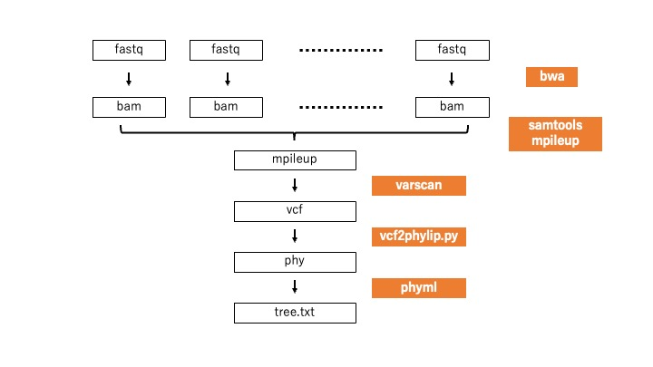

# MRSA_typingの内容
MRSAのショートリードを参照配列にマッピング<br>
snippyで複数サンプルのアライメント<br>
gubbinsで組み換え配列の削除<br>
snp情報から系統樹を作成<br>


## 参考文献
下記の論文の解析結果の再現を試みる<br>
組み換え配列の除外にClonalFrameMLを使っているが、本解析では代替としてgubbinsを使用<br>
[Changes in the Genotypic Characteristics of Community-Acquired Methicillin-Resistant Staphylococcus aureus Collected in 244 Medical Facilities in Japan between 2010 and 2018: a Nationwide Surveillance](https://journals.asm.org/doi/epub/10.1128/spectrum.02272-21)

実際の解析フローは下記の論文に添付されているsnakemakeのフローに準じる<br>
[Whole Genome Sequencing Analysis of Porcine Faecal Commensal Escherichia coli Carrying Class 1 Integrons from Sows and Their Offspring](https://www.mdpi.com/2076-2607/8/6/843)<br>
[GitHubサイト](https://github.com/CJREID/snplord)

## ダウンロードデータ
[PRJDB11170](https://www.ncbi.nlm.nih.gov/Traces/study/?acc=DRP008386&o=acc_s%3Aa)

## 参照ゲノム(data/fastaに保存)
CC8: [NC_007793](https://www.ncbi.nlm.nih.gov/nuccore/NC_007793)<br>
CC22: [NZ_CP007659](https://www.ncbi.nlm.nih.gov/nuccore/NZ_CP007659)<br>
CC30: [NZ_CP009361](https://www.ncbi.nlm.nih.gov/nuccore/NZ_CP009361)<br>
CC59: [CP003166](https://www.ncbi.nlm.nih.gov/nuccore/CP003166)

## 解析のフロー
1. MRSAの各サンプルのfastqファイルの取得
2. 各MRSAタイプのゲノムにbwaでマッピング
3. bamファイルをsamtoolsのmpileupで統合
4. 統合したmpileupファイルをvarascanでバリアントコールし、vcfファイルを作成
5. vcf2phylip.pyでvcfファイルをphyファイルに変換
6. phymlでphyファイルを読み込み、系統樹を作成
7. FigTreeで系統樹を可視化
  


## 各種ツールの準備
### 仮想環境の構築
```
mamba create -n mrsa python=3.10 -y
mamba activate mrsa
```
### 必要なライブラリのインストール
```
mamba install -c bioconda parallel-fastq-dump -y
mamba install -c bioconda sra-tools -y
mamba install -c bioconda bwa -y
mamba install -c bioconda samtools -y
mamba install -c bioconda varscan -y
mamba install -c bioconda phyml -y
```
### vcf2phylip.pyのインストール
[vcf2phylip](https://github.com/edgardomortiz/vcf2phylip): vcf2phylip.pyの実行ファイルの取得
```
git clone https://github.com/edgardomortiz/vcf2phylip.git
sudo cp vcf2phylip/vcf2phylip.py /usr/local/bin
```
## 解析の実行
### fastqファイルの取得(CC30のサンプルのみ)
ときにファイルダウンロードに失敗することあり、確認必要
```
for i in $(cat data/fastq/samples.txt); do parallel-fastq-dump --threads 8 --split-files --gzip --outdir data/fastq --sra-id $i; done
```
### MRASゲノムのindexファイルの作成
```
bwa index -p data/fasta/CC30/NZ_CP009361_1 data/fasta/CC30/NZ_CP009361_1.fasta
```

### 各サンプルのファイル名の変更およびディレクトリの作成
```
cd data/fastq
awk '{print  $1 "_1.fastq.gz " $2 "_1.fastq.gz"}' supple_file2.txt | xargs -n 2 mv
awk '{print  $1 "_2.fastq.gz " $2 "_2.fastq.gz"}' supple_file2.txt | xargs -n 2 mv
for i in $(awk '{print $2}' supple_file2.txt); do mkdir $i; done
for i in $(awk '{print $2}' supple_file2.txt); do mv $i*.fastq.gz $i; done
```
### bwaでマッピング
```
for i in $(awk '{print $2}' supple_file2.txt); do bwa bwasw ../fasta/CC30/NZ_CP009361_1 -t 40 $i/$i\_1.fastq.gz $i/$i\_2.fastq.gz | samtools view -@16 -bS | samtools sort -@16 -T temp -o $i/$i\.bam; done
```
### bamファイルをmpileupファイルとして統合
```
mkdir mpileup
samtools mpileup -B -q 1 -f ../fasta/CC30/NZ_CP009361_1.fasta $(ls */*.bam) > mpileup/CC30.mpileup
```
### varscanでバリアントコール
```
mkdir varscan
varscan mpileup2cns mpileup/CC30.mpileup --output-vcf 1 --min-var-freq 0.9 --min-coverage 30 --min-reads2 20 --min-avg-qual 25 > varscan/CC30.vcf
```
### vcfファイルをvcf2phylip.pyでphylipファイルに変換
```
vcf2phylip.py -i varscan/CC30.vcf --output-folder phyml
```
### phymlで系統樹を作成
```
phyml -i phyml/CC30.min4.phy -d nt -b 100 -m GTR
```
### phylipファイルのサンプル名の書き換え
```
python phy_conv.py phyml/CC30.min4.phy_phyml_tree.txt
```